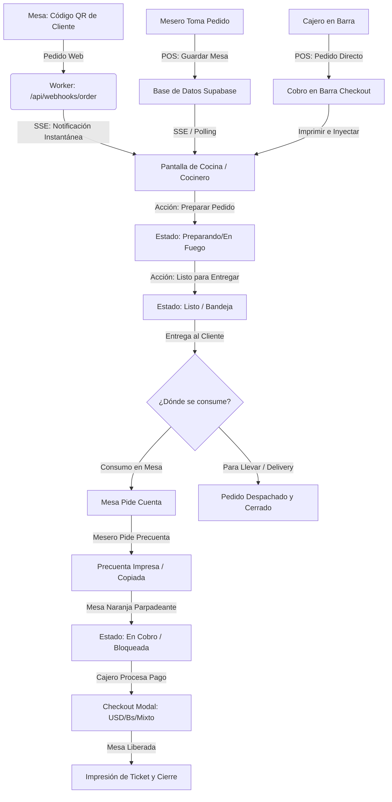

# Guía del Flujo de Trabajo y Matriz de Roles: Tasas al Día

Este documento define la estructura operativa, responsabilidades y el flujo de trabajo del ecosistema de comida rápida del sistema, integrando los cuatro roles clave: **Administrador**, **Mesero**, **Cajero** y **Cocinero**.

---

## 1. Definición de Roles y Permisos

| Rol | Alcance de Operación | Permisos Clave | Restricciones |
| :--- | :--- | :--- | :--- |
| **Administrador** (`ADMIN`) | Supervisión total del negocio y configuración global. | Gestión de inventario/precios, edición de tasas de cambio (BCV/Euro), reportes de ganancias, cierres de caja, anulación de transacciones, altas y bajas de operadores, configuración de ticket e impresora. | Ninguna. |
| **Cajero** (`CAJERO`) | Gestión de la caja registradora, cobros y facturación. | Ventas directas (barra), cobro de mesas, apertura/cierre de caja diario, gestión de deudas/crédito de clientes, impresión de recibos de pago. | No puede cambiar precios, no puede editar tasas de cambio, no ve reportes financieros consolidados ni ajustes del sistema. |
| **Mesero** (`MESERO`) | Atención directa en mesas y toma de pedidos en piso. | Apertura de mesas, adición de platos al pedido, envío de comandas a cocina, solicitud de pre-cuenta y solicitud de cobro en caja. | Bloqueado para facturar/cobrar, no puede aplicar descuentos libres, no puede ver histórico de ventas de caja ni configuraciones. |
| **Cocinero** (`COCINERO`) | Preparación y despacho de platos en cocina. | Visualización de pedidos (List/Kanban), marcar platos en preparación, listos para entrega y confirmación de entrega física. | No tiene acceso a cobros, mesas, inventario, caja ni configuraciones. Solo opera la pantalla de Cocina. |

---

## 2. Mapa Visual del Flujo de Trabajo

El siguiente diagrama detalla la ruta de un pedido desde que ingresa al sistema por cualquiera de las 3 vías disponibles hasta que el cliente recibe su comida y se consolida la transacción.

---

## 3. Flujo Detallado de Trabajo (Paso a Paso)

### Paso 1: Recepción del Pedido
El sistema soporta tres modalidades de ingreso:
* **Mesa con QR (Autoservicio):** El cliente escanea el QR. El menú se sirve en $<50$ ms desde el caché del Worker. El cliente envía el pedido, ingresando a Supabase como `status: pending` (para confirmación de cajero) o directamente a `status: kitchen` (según configuración).
* **Toma de Pedido de Mesero:** El mesero local abre una mesa desde el plano de distribución en su tablet, añade los platos y presiona **"Enviar a Cocina"**. La mesa se guarda, se imprime la comanda física (si hay impresora en cocina) y se genera una alerta sonora en la pantalla del Cocinero.
* **Toma de Pedido de Cajero (Barra/Fast Food):** El cliente pide directamente en caja. El cajero marca los productos y de inmediato abre el modal de Checkout, cobra en la combinación de divisas/bolívares que prefiera el cliente, imprime el ticket y la comanda viaja a cocina de forma automática.

### Paso 2: Preparación (Cocinero)
* El cocinero ve el pedido en su panel. Si el tiempo de espera sube a 10 minutos, la tarjeta cambia a color naranja de advertencia; a los 15 minutos, parpadea en color rojo de urgencia.
* El cocinero presiona **"Preparar Pedido"**. El estado de la orden cambia a `PREPARING` (fuego).
* Una vez que la comida está lista en bandeja, el cocinero presiona **"Listo para Entregar!"**.
  * Si es un pedido web de delivery o para llevar, se habilita al cajero la opción de **"Avisar al Cliente por WhatsApp"** para que retire.
  * Si es una mesa, el mesero visualiza el plato listo y lo lleva a la mesa.

### Paso 3: Cierre y Pago (Mesero & Cajero)
* El cliente solicita la cuenta a la mesa.
* El **Mesero** abre los detalles de la mesa y presiona **"Pre-cuenta"**.
  * Se genera el documento térmico para llevar a la mesa.
  * La mesa cambia de color en el plano a **naranja parpadeante (`EN COBRO`)** y queda **bloqueada** para los meseros (evita que se añadan o modifiquen platos por error mientras se procesa el cobro).
* El cliente entrega el dinero. El **Cajero** abre la mesa en cobro, presiona **"Proceder al Pago"** (lo que cierra la ventana de mesas y abre la pasarela de checkout con los totales fijos).
* El cajero ingresa los montos en USD/Bs correspondiente, procesa el vuelto en el monedero digital del cliente si es necesario, y confirma el cobro.
* La mesa se libera de forma automática, el ticket se imprime con el logo oficial del sistema y la venta se registra en el reporte de caja diario.

---

## 4. Variantes, Excepciones y Auto-Recuperación (Self-Healing)

### Variante A: El cliente quiere agregar más cosas después de pedir la pre-cuenta
* **El Problema:** La mesa está bloqueada en estado naranja (`EN COBRO`). El mesero no puede editarla.
* **La Solución:** El mesero debe pedirle al **Cajero** que libere la mesa. El cajero abre la mesa y presiona **"Devolver a Mesa"**. Esto restaura el estado a verde activo, permitiendo añadir productos y reiniciando el flujo.

### Variante B: Falla de conexión con la impresora física en plena venta
* **El Problema:** El cajero da clic a cobrar o el mesero a pre-cuenta, pero la impresora térmica USB está desconectada, apagada, o el navegador no soporta Web Serial (móviles).
* **La Solución (Auto-Recuperación):** 
  * El hook de impresión captura el error y copia automáticamente el ticket formateado en texto plano al portapapeles del dispositivo, mostrando un toast: *“Impresora no conectada. Ticket copiado al portapapeles”*. 
  * De esta forma, el operador puede pegar la comanda en WhatsApp para enviársela al motorizado o utilizar la impresora nativa del sistema operativo como respaldo sin detener el flujo.

### Variante C: Pérdida total de conexión a Internet
* **El Problema:** El local se queda sin internet en horas pico.
* **La Solución (Modo Offline):** 
  * El POS sigue funcionando en su totalidad. Las ventas del cajero y las mesas se leen y escriben localmente en el `storageService` (IndexDB).
  * Los cambios de platos creados por el Administrador se guardan localmente.
  * Al restablecerse la conexión, el hook de sincronización en segundo plano (`useCloudSync.js`) detecta el internet, reconcilia los datos basándose en marcas de tiempo (`updated_at`), sube las ventas acumuladas a Supabase, e invalida la caché del Cloudflare Worker de forma silenciosa.
